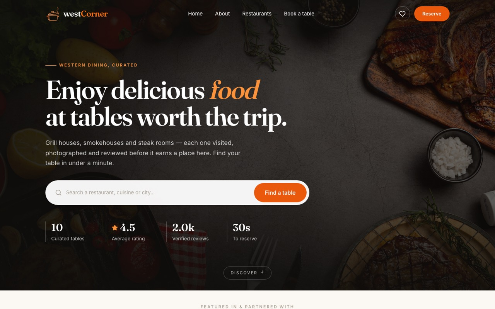
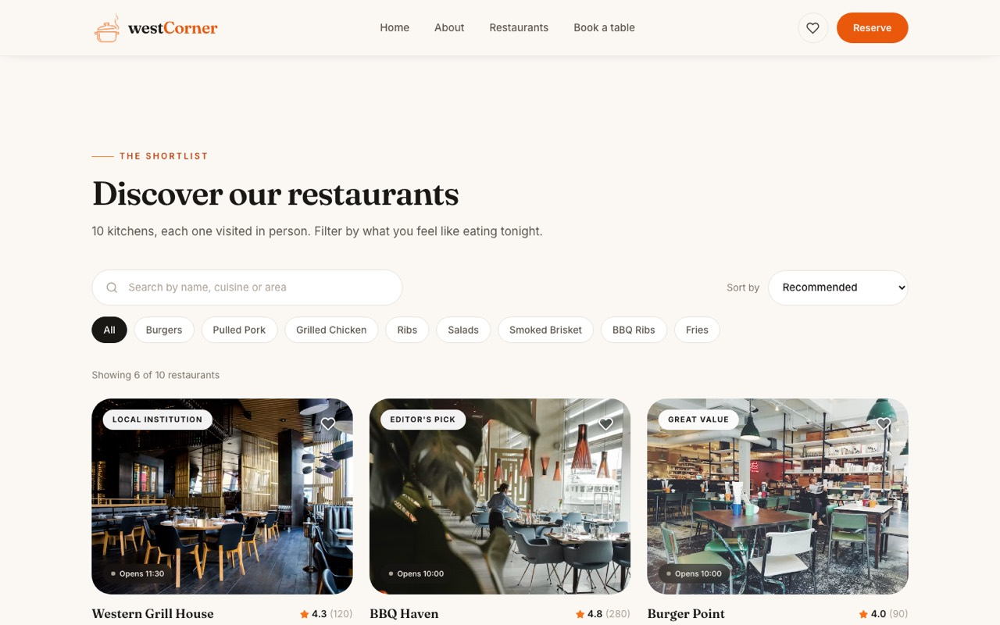
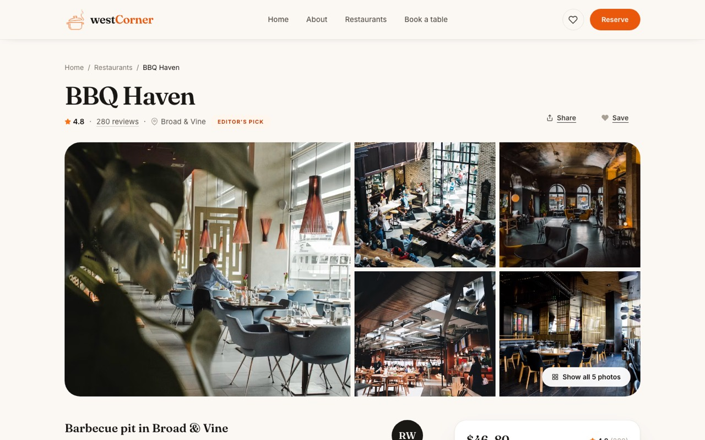
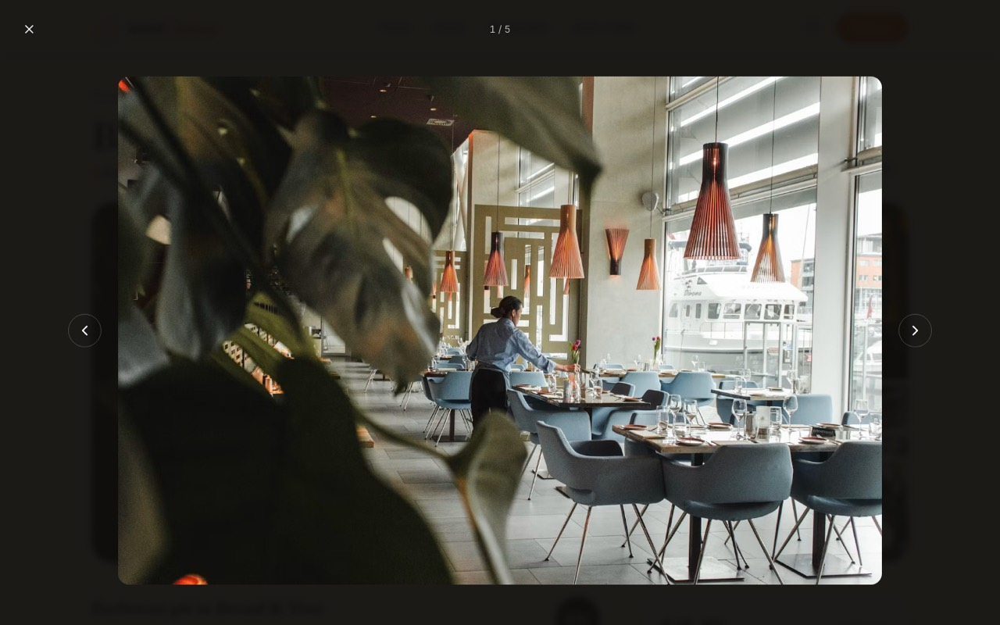
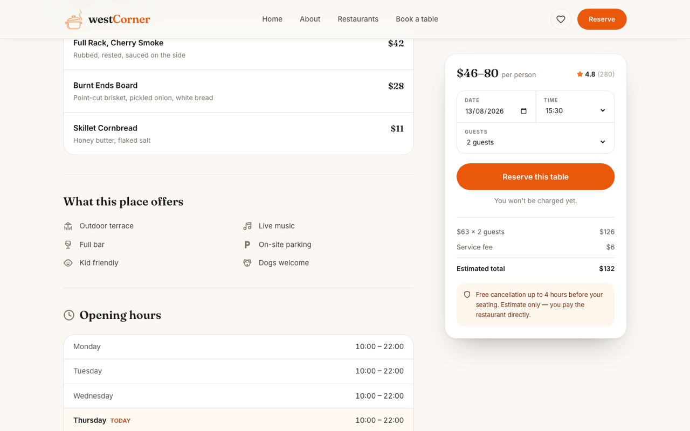
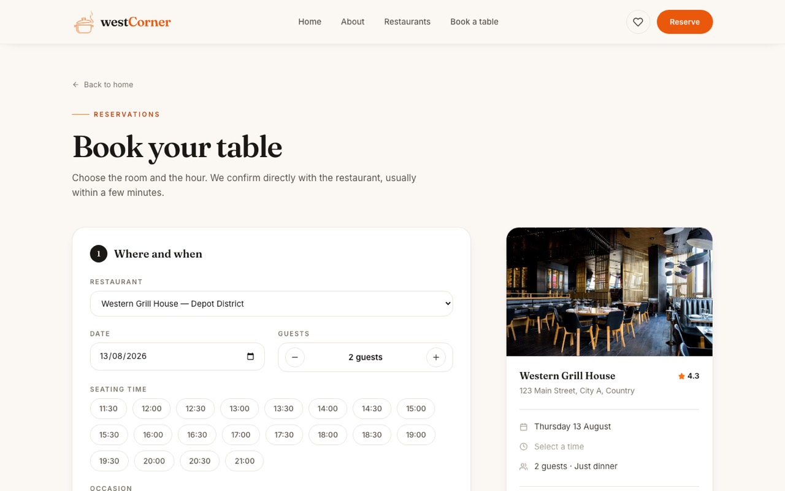
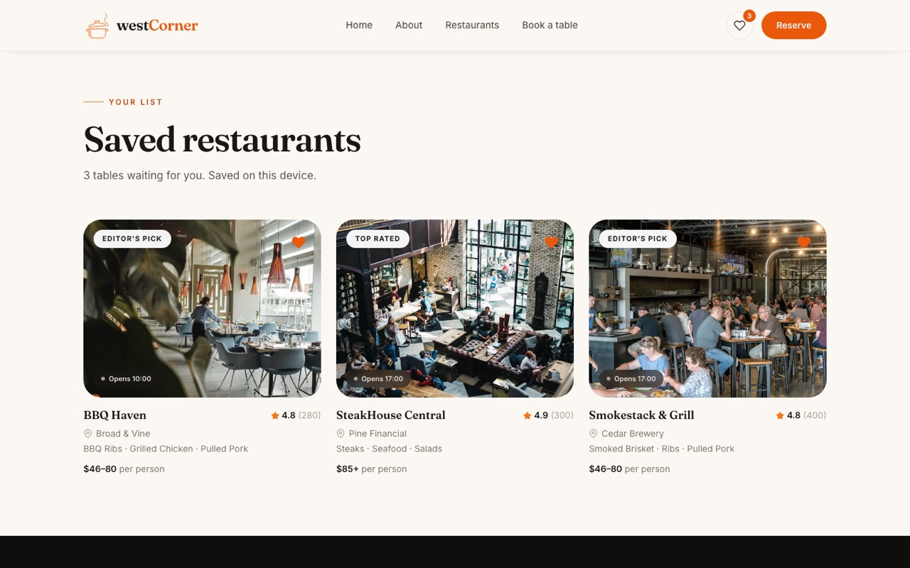

<div align="center">

# westCorner — Restaurant Discovery & Reservation Platform

Aplikasi web untuk menemukan dan memesan meja di restoran western: situs editorial dengan katalog terkurasi, halaman detail bergaya Airbnb, alur reservasi lengkap, dan daftar simpanan pribadi. Bukan tumpukan card seragam — setiap halaman dirancang ulang dari nol dengan design system sendiri, dan setiap alur (cari, filter, simpan, booking) benar-benar berfungsi sampai ke layar konfirmasi.


</div>



## Fitur Utama

### Situs Publik
- Hero full-bleed dengan kolom pencarian yang langsung terhubung ke katalog di bawahnya, plus statistik yang **dihitung dari data** (jumlah restoran, rata-rata rating, total ulasan) — bukan angka yang diketik manual
- Marquee logo partner dengan loop tanpa sambungan (track digandakan lalu digeser tepat -50%)
- Katalog restoran: pencarian lintas nama/masakan/area/alamat, filter chip per jenis masakan, 5 opsi pengurutan, paginasi *show more*, dan empty state yang rapi
- Card restoran bergaya Airbnb: badge editorial, pill status buka/tutup realtime, rating, kisaran harga per orang, dan tombol simpan yang tidak ikut memicu navigasi
- Animasi masuk saat scroll (`IntersectionObserver`) yang menghormati `prefers-reduced-motion`

### Halaman Detail
- Mosaic foto 5 gambar di desktop, strip snap-scroll di mobile, dan **lightbox** dengan navigasi panah/`Esc` serta penghitung foto
- Panel booking sticky: tanggal, jam, jumlah tamu, estimasi tagihan, dan tombol reservasi yang membawa pilihannya ke halaman booking lewat router state
- Menu andalan dengan harga, fasilitas dengan ikon (bisa di-expand), dan tabel jam buka mingguan dengan hari berjalan di-highlight
- Breakdown rating 1–5 bintang beserta ulasan individual berikut avatar inisial berwarna konsisten per nama
- **Peta lokasi** yang dirakit dari tile raster OpenStreetMap + marker brand, plus tautan ke Google Maps
- Sticky reserve bar menggantikan panel booking di layar mobile

### Reservasi
- Form dua tahap: pilih restoran/tanggal/tamu/jam/acara, lalu data kontak
- **Slot waktu dihitung dari jam buka restoran yang dipilih** — setiap 30 menit, berhenti 60 menit sebelum tutup, dan menampilkan pesan "tutup pada hari itu" kalau restorannya libur
- Validasi inline per field dengan fokus otomatis ke error pertama
- Panel ringkasan sticky yang mencerminkan pilihan secara realtime beserta estimasi biaya (subtotal + service fee)
- Layar konfirmasi dengan kode referensi, ringkasan pesanan, dan tautan balik ke restorannya

### Daftar Simpanan
- Simpan/hapus restoran dari card mana pun maupun dari halaman detail
- State favorit dibagikan lewat `useSyncExternalStore` di atas `localStorage`, jadi satu klik langsung tercermin di card, tombol detail, **dan** penghitung di navbar — termasuk kalau diubah dari tab browser lain

## Screenshot

| Homepage | Katalog — pencarian, filter, sorting |
|---|---|
|  |  |

| Detail restoran — mosaic foto + panel booking | Lightbox foto |
|---|---|
|  |  |

| Detail — menu, fasilitas, jam buka | Reservasi — slot waktu dari jam buka |
|---|---|
|  |  |

| Daftar simpanan |
|---|
|  |

## Tech Stack

| Layer | Teknologi |
|---|---|
| Framework | [React 18](https://react.dev) + [Vite 5](https://vite.dev) |
| Routing | [React Router 6](https://reactrouter.com) |
| Styling | [Tailwind CSS 3](https://tailwindcss.com) + design system sendiri (token warna, tipografi, elevasi, easing) |
| Arsitektur komponen | Atomic Design — atoms → molecules → organisms → templates → pages |
| State | React hooks; favorit lewat `useSyncExternalStore` di atas `localStorage` |
| Ikon | [react-icons](https://react-icons.github.io/react-icons/) (Feather, Font Awesome, Lucide, Material) |
| Font | [Fraunces](https://fonts.google.com/specimen/Fraunces) (display) + [Inter](https://fonts.google.com/specimen/Inter) (UI) |
| Peta | Tile raster [OpenStreetMap](https://www.openstreetmap.org) (tanpa dependency peta) |
| Deploy | [Vercel](https://vercel.com) dengan SPA rewrite |

## Arsitektur

```
src/
├── App.jsx                     definisi route
├── index.css                   base style + class komponen bersama
├── data/
│   ├── restaurants.js          katalog + helper turunan
│   └── amenities.js            key fasilitas → label + ikon
├── lib/
│   ├── format.js               inisial, plural, tanggal, mata uang, href
│   ├── pricing.js              estimasi tagihan + service fee
│   └── booking.js              daftar acara, batas tamu, validasi form
├── hooks/
│   ├── useFavorites.js         store favorit berbasis localStorage
│   └── useBooking.js           tanggal / jam / tamu + slot + tagihan
├── components/
│   ├── atoms/                  Button, Chip, Badge, Rating, Stars, Avatar,
│   │                           StatusPill, Eyebrow, Divider, Logo, Reveal,
│   │                           SectionLink
│   ├── molecules/              SectionHeading, SearchField, ChipGroup,
│   │                           FormField, TextField, GuestStepper,
│   │                           PriceBreakdown, EmptyState, FeatureList,
│   │                           FactList, DetailSection, ServiceCard,
│   │                           RestaurantCard, ReviewCard
│   ├── organisms/              Navbar, Footer, Hero, BrandMarquee,
│   │   │                       AboutSection, RestaurantListing,
│   │   │                       RestaurantGrid, ReservationBanner
│   │   ├── detail/             DetailHeader, DetailGallery, DetailOverview,
│   │   │                       DetailMenu, DetailAmenities, DetailHours,
│   │   │                       DetailReviews, DetailLocation, StaticMap,
│   │   │                       BookingPanel, MobileReserveBar
│   │   └── booking/            BookingForm, BookingSummary,
│   │                           BookingConfirmation
│   └── templates/              PageLayout, ScrollToTop
└── pages/                      Home, RestaurantDetail, Booking, Saved, NotFound
```

## Menjalankan Secara Lokal

### 1. Clone & install

```bash
git clone https://github.com/RizqGyx/Restaurant-react.git
cd Restaurant-react
npm install
```

### 2. Jalankan development server

```bash
npm run dev
```

Buka [http://localhost:5173](http://localhost:5173).

### Perintah lain

```bash
npm run build     # build produksi ke dist/
npm run preview   # jalankan hasil build secara lokal
npm run lint      # eslint, nol warning
```

Butuh Node 18 atau lebih baru. Tidak ada environment variable maupun setup database — cukup
`npm install` lalu jalan. Foto restoran diambil dari Unsplash, jadi tampilan penuh butuh koneksi
internet.
